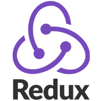

### Hi there👋

I'm a Software Developer based in Berlin 🇩🇪 (originally from Japan 🇯🇵). I started my developer career as a backend developer. Now I'm enthusiastic about Android Development.

### Languages and Tools

Mobile App:

 

Frontend Development:

  

Backend Development:

       

Local Environment:

   

<a href="https://www.freepik.com/vectors/travel">Travel vector created by vectorpocket - www.freepik.com</a>

